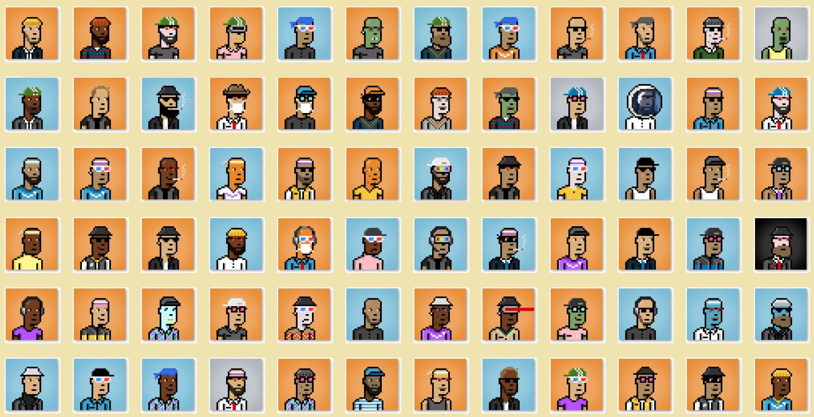

# Create your own NFT collection: Python

Script to create image + json collection from folder traits.

### Requirements

* Python 3.6 or higher
* [PIL](https://pillow.readthedocs.io/en/stable/) (Install by running `pip install pillow`)

## Before start
### input folder
Prepare a folder where the applied layers will be located. The program requires them to have specific prefixes to be able to sort them.
Example: trait1, trait2
Remember that your folders should contain a prefix such as '0'

The folder name is also important, as it will be entered into the trait attribute. From the example 'trait1' to json, the attribute will be written in the form : {"trait_type": "trait1", "value": "xyz"},

deletes everything after the _ sign (trait1_lol2 = trait1)

### Usage

run application

### output
The result of the script is a created collection folder containing:
image
json (the same name like images)
and file contains a list of all generated images
